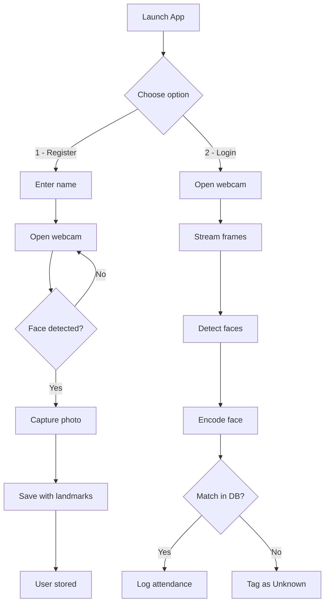

# AI Attendance Model


A face recognition-based attendance system that uses computer vision to register and authenticate users via webcam.

## Stack

- Python 3
- OpenCV — real-time video capture and frame processing
- face_recognition — face detection and encoding comparison
- dlib — 68-point facial landmark detection
- tkinter / PIL — desktop GUI
- HOG + CNN — face detection models

## How it works

The system has two modes:



**Registration** — A new user enters their name. The webcam opens and automatically captures their photo when a face is detected. The image is saved to disk with facial landmarks overlaid.

**Login / Attendance** — The webcam streams live video. Each frame is scanned for faces. Detected faces are encoded and compared against the registered user database. A match triggers an attendance record; unknown faces are tagged accordingly.

Facial landmarks (eyes, nose, jawline) are computed using dlib's shape predictor and drawn as blue dots on the video feed — providing real-time feedback that the face is being properly analyzed.

## Key features

- Real-time face detection and recognition via webcam
- 68-point facial landmark visualization
- Automatic photo capture on face detection
- Tkinter GUI with live video preview
- HOG-based detection (lightweight, CPU-friendly)

## What this demonstrates

- Practical computer vision pipeline integration
- Working with multiple CV libraries (OpenCV, dlib, face_recognition) in a single application
- Building a desktop GUI with live video streaming
- Image processing and encoding algorithms

## Run locally

```bash
pip install opencv-python face_recognition dlib pillow
python PROTOTYPE.PY
```

> Note: Download `shape_predictor_68_face_landmarks.dat` from dlib's model zoo and place it in the project root.
